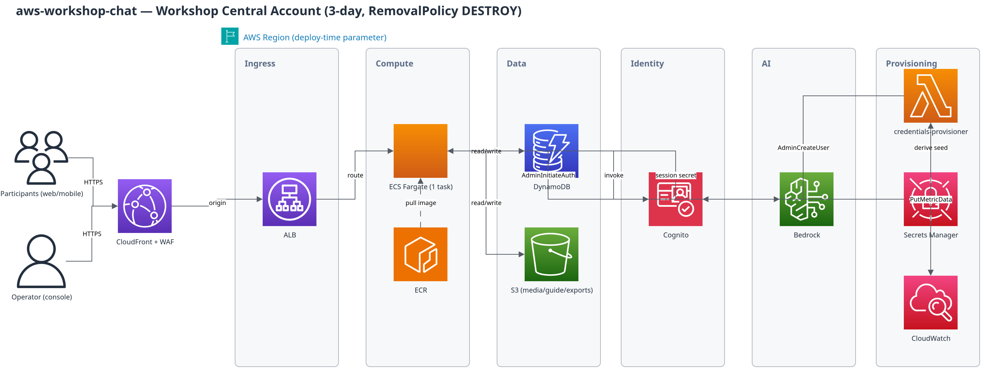

# aws-workshop-chat

A disposable Q&A/chat app for AWS workshops (10–500 participants, ~3 days). Deployed once into a
workshop's Central Account, deleted with that account when the workshop ends. Its only permanent
output is one xlsx file you download before that happens.

It exists to remove three specific Slack-workspace failure modes: bulk invites getting blocked as
spam, no way to separate repeat cohorts, and unanswered questions scrolling out of sight past ~50
participants. See `docs/DATA_MODEL.md` for the data design and the plan history for the full
rationale.

## What this is not

- Not a permanently-hosted product. Nothing here should outlive the workshop.
- Not tied to Workshop Studio's account-vending or cross-account AssumeRole — this repo only
  builds the chat app itself, deployed standalone by whoever runs the workshop.
- Not a video platform — mp4 uploads are capped at 50 MB, no transcoding, by design (§6.4 of the
  original spec).

## Architecture

```
CloudFront (+ WAF rate limit)
  └── ALB → ECS Fargate (1 task) ── single Node/Fastify process:
        - static React frontend (chat / Q&A board / operator console)
        - REST API
        - in-process WebSocket broadcast hub
DynamoDB (single table, on-demand)         — all app state
Cognito User Pool                          — participant + credential source of truth
S3: media / guide / exports (all auto-deleted with the stack)
Bedrock Knowledge Base (S3 Vectors) + Converse — AI chat over the lab guide
Secrets Manager                            — one seed, dual-purpose (see below)
```



Diagram source: `docs/architecture-spec.yaml` → `docs/architecture.drawio` (built via the
`aws-content-plugin:architecture-diagram` skill; regenerate with `layout_aws.py` after editing
the spec).

### Why a single Fargate task instead of AppSync Events

The original spec called for AppSync Events for realtime. This app uses a plain in-process
WebSocket hub instead (`app/src/ws/hub.ts`) — a `Map<channel, Set<socket>>` and a `for` loop to
broadcast. That only works within one process, so `desiredCount` is pinned to **1**. This is a
known, deliberate ceiling, not an oversight: load-tested at 500 concurrent WebSocket clients (the
spec's stated maximum) on a single 1 vCPU / 2 GB task with **p50 17ms / p95 20ms** broadcast
latency and zero dropped deliveries (`npm run loadtest`, see below). AppSync Events would buy
horizontal scaling this app will never need, in exchange for a namespace, channel-authorization
handlers, and a client SDK it doesn't need either. If a future workshop ever needs more than one
task, fan out via DynamoDB Streams instead of reaching for AppSync — see the comment in `hub.ts`.

### Why ECS Fargate instead of App Runner or Lambda

App Runner is documented as request/response only — it does not support the long-lived WebSocket
connections this app depends on. Lambda-per-connection (API Gateway WebSocket) would need
connection-state tracking in DynamoDB that a single long-running process gets for free. One
Fargate task behind an ALB is the smallest thing that actually holds a WebSocket open.

### Why Cognito is the credential source but not the request-time gate

Cognito remains the deploy-time source of truth for participant credentials (created idempotently
by the credentials-provisioner Lambda, `infra/lambda/credentials-handler.ts`). But the one-click
`/j` join link uses the app's **own** HMAC-signed session tokens, not a Cognito JWT round-trip —
see `app/src/auth/token.ts` and `app/src/auth/session.ts`.
Re-verifying against Cognito on every page load would add IdP latency for zero benefit on a
disposable, 3-day app. A **single secret** does both jobs: the credentials-provisioner Lambda uses
it to *derive* each participant's Cognito ID/password, and the app container reuses the exact same
value to *sign* join tokens — so the operator console can re-derive any participant's ID and mint
their join link on demand, with no separate roster to keep in sync (`infra/lib/workshop-chat-stack.ts`,
the `CredentialSeed` secret). Cognito's own `AdminInitiateAuth` is still wired up and used for the
"type your individually-issued password" fallback path (`app/src/auth/cognito.ts`).

### Region fallback for AI chat

The AI chat (`app/src/ai/ask.ts`) prefers a Bedrock Knowledge Base backed by **S3 Vectors** (no
provisioned infrastructure, no OpenSearch Serverless minimum — deploy with
`--context enableKnowledgeBase=false` if S3 Vectors isn't available in your target region). When
disabled, the app falls back to injecting the whole lab guide directly into the system prompt
(capped at ~60k characters), loaded from S3 or a local `guide/` mount. Which mode is active is
logged once at container startup.

## Identity and privacy — deviation from the original spec

Participant identities here are **synthetic 12-digit numbers generated at deploy time**, not real
AWS account IDs (Organizations discovery and cross-account AssumeRole were dropped — see below).
Because of that, the original spec's login-screen notice ("운영자는 참가자의 AWS 계정 ID를 확인할
수 있습니다") would be false, so it's been changed to:

> 참가자 간에는 익명입니다. 운영자는 참가자에게 발급된 참가자 ID를 확인할 수 있습니다.

No email, name, or real AWS account ID is ever collected or stored. The xlsx export's `accountId`
columns are renamed `participantId` throughout for the same reason.

## Deploy

```bash
cd infra
npm install
npx cdk bootstrap   # once per account/region, if not already done
npx cdk deploy \
  --context workshopName="woori-1030" \
  --context scale="large" \
  --context bedrockModelId="global.anthropic.claude-sonnet-5" \
  --context adminUsername="admin@ws" \
  --context participantPassphrase="woori-1030" \
  --context participantCount="120" \
  --context enableKnowledgeBase="true"
```

The container image is built and pushed by CDK itself (`ContainerImage.fromAsset`, built for
**arm64** to match the task's `runtimePlatform`) — there's no separate ECR push step, and no
first-deploy ordering problem. Re-running `cdk deploy` after an app code change rebuilds and
redeploys the image automatically.

**Model ID caveat:** many regions (including `ap-northeast-2`) only expose Claude models as
`INFERENCE_PROFILE`, not `ON_DEMAND` — check with `aws bedrock get-foundation-model
--model-identifier <id> --query modelDetails.inferenceTypesSupported`. A model ID that's
`ON_DEMAND`-only elsewhere will deploy fine and then fail on the first question.

Before deploying, replace the placeholder in `guide/` with your actual lab guide markdown — it's
uploaded to S3 and ingested by the Knowledge Base (or injected directly, in fallback mode) as-is.

Region and account come from your CLI's configured environment
(`CDK_DEFAULT_REGION`/`CDK_DEFAULT_ACCOUNT`) — nothing is hardcoded in the stack. Deploy from
whichever region is closest to your participants.

**Bedrock in a different region (`bedrockRegion`).** Some environments — an AWS Workshop Studio
participant account, for example — only expose Bedrock (models, Knowledge Bases, S3 Vectors) in
one specific region, usually `us-east-1`, while the rest of the app should still deploy near your
participants. Pass `--context bedrockRegion="us-east-1"` and everything Bedrock-related
(`lib/bedrock-stack.ts`: the KB, S3 Vectors bucket/index) deploys there as its own stack, cross-
region-referenced into the main one — same pattern as the WAF stack below. Omit it and Bedrock
stays in the main stack's own region, unchanged from before.

**Outputs** (`npx cdk deploy` prints these, or `aws cloudformation describe-stacks`):
`AppUrl`, `OperatorConsoleUrl` (`<AppUrl>/operator`), `ExportBucketPath`, `GuideBucketPath`,
`GuideSyncCommand` (when the Knowledge Base is enabled), `OperatorUsername`,
`OperatorCredentialsCommand`, `CloudWatchMetricsLink`.

### Operator login

The one operator account (`adminUsername`, default `admin@ws`) is a real Cognito user,
provisioned at deploy time with a random password that never appears in the stack template.
Retrieve it with the `OperatorCredentialsCommand` output:

```bash
aws secretsmanager get-secret-value --region <region> --secret-id <OperatorPassword arn> \
  --query SecretString --output text
```

Every `cdk deploy` re-syncs this password to whatever's currently in Secrets Manager (unlike
participant provisioning, which only fills in the delta) — useful after a manual rotation.

**Role comes from Cognito group membership, not a hardcoded username.** The credentials
provisioner puts the operator account in the `admin` group and every participant account in the
`participant` group at creation time; a single login form/endpoint (`/api/login/id`) serves
both — it checks group membership (`AdminListGroupsForUser`) after the password check succeeds
to decide the role, rather than comparing the username against
`adminUsername` directly. A correct password for a user in the wrong group is rejected. This
only applies to that one Cognito-backed login path — the one-click `/j` join link never touches
Cognito at request time (see "Why Cognito is the credential source but not the request-time
gate" above), so it's unaffected.

### Custom domain

Optional — pass all three together to put the app behind your own hostname instead of the raw
CloudFront domain:

```bash
  --context domainName="workshop-chat.example.com" \
  --context hostedZoneId="Z0123456789ABCDEFGHIJ" \
  --context certificateArn="arn:aws:acm:us-east-1:<account>:certificate/<id>"
```

The ACM certificate **must be in `us-east-1`** (a CloudFront requirement, regardless of which
region the stack itself deploys to) and must cover `domainName`. `hostedZoneId` must be a public
zone you control; the stack adds alias A/AAAA records to it.

### Guide documents

The operator can upload additional lab-guide files directly to the `GuideBucketPath` output
(under its `guide/` prefix) at any time — they are not wiped by later `cdk deploy` runs.
Supported formats: `.txt`, `.md`, `.html` (UTF-8), `.doc`/`.docx`, `.csv`, `.xls`/`.xlsx`, `.pdf`
(max 50 MB each), and `.jpeg`/`.png` (max 3.75 MB each, multimodal). Files outside `guide/` are
ignored. Uploading does **not** trigger re-indexing by itself — run the `GuideSyncCommand`
output after the initial deploy and again after every guide change:

```bash
aws bedrock-agent start-ingestion-job --region <region> \
  --knowledge-base-id <KnowledgeBaseId> --data-source-id <GuideDataSourceId>
```

Oversized files are silently skipped (listed in the ingestion job's `failureReasons`, not a hard
failure) — check that if a document doesn't show up in AI answers.

### Raising participant count mid-workshop

Late-joining teams are handled by simply re-deploying with a higher `participantCount` — the
credentials provisioner is idempotent (proven in `app/test/credentials.test.ts`): it only creates
the delta, never touches or duplicates existing participants.

## Operate

Open `<AppUrl>/operator` and log in with the operator username/password (see "Operator login"
above). From there:

- **참가자 조인 링크** — one row per participant with a ready-to-click join URL + CSV download.
  Distributing this list (via SSM broadcast, chat, however your workshop platform prefers) is
  outside this repo's scope; generating it is not.
- **미해결 질문** — every open question, auto-refreshing every 15s. This is the screen an
  operator should have open, not the chat timeline — "who's stuck right now" is the whole point.
- **랩 스텝** — one selector; every question and AI query gets auto-tagged with whatever's
  selected here, for free, at write time.
- **참가자** — block/unblock, per participant.
- **지금 내보내기** — always visible, always reflects current state. A background timer also
  refreshes `exports/latest.xlsx` on S3 every 15 minutes regardless of anyone clicking anything.

**⚠️ Download the export before the account is reclaimed. Nothing here persists past that —
media, messages, and the xlsx itself all live inside resources this stack owns, and all of them
disappear on `cdk destroy` or account deletion, whichever comes first.**

### Fallback communication channel

This app is the participants' main channel, not their only one. Per the original spec's rule
against single points of failure for workshop communication: **print a QR code to a backup
Slack or Discord invite** and have it visible on a slide before the workshop starts, independent
of whether this app is reachable.

## Local development

```bash
docker compose up --build
```

Runs the full stack against DynamoDB Local — chat, threads, upvotes, resolve, moderation, media
presign, xlsx export, and lab-step tagging are all testable with **no AWS account**. The one
exception is AI chat: Bedrock has no local emulator, so `/api/ai/ask` needs real AWS credentials
exported into your shell before `docker compose up` (and a real `BEDROCK_MODEL_ID`).

Login is Cognito-backed only (`/api/login/id`) — there is no passphrase fallback anymore, so
local dev needs real AWS credentials exported into your shell (same as the AI chat exception
above) to reach a real Cognito user pool, even just to log in and exercise chat/threads/upvotes.

### Tests

```bash
cd app && npm test
```

Three suites, per the original spec's testing mandate:

| Suite | What it proves |
|---|---|
| `test/xlsx.test.ts` | The 4-sheet export produces the exact column contract, including archived-channel and silent-participant rows |
| `test/credentials.test.ts` | Provisioning is idempotent — re-running at the same N creates nothing, raising N creates exactly the delta |
| `test/token.test.ts` | Tampered, truncated, wrong-signature, and expired join/session tokens are all rejected |

### Load test

```bash
docker compose up -d
npm run loadtest -- --clients 60
npm run loadtest -- --clients 500
```

Measured on this app (single container, local Docker, so treat as a floor, not a ceiling on real
Fargate networking):

| Clients | Broadcast latency (p50 / p95) | Dropped deliveries |
|---|---|---|
| 60 | 9ms / 14ms | 0 |
| 500 | 17ms / 20ms | 0 |

## Cost estimate

Rough order of magnitude for a 3-day workshop at moderate use (ap-northeast-2 pricing, illustrative):

| Resource | Estimate |
|---|---|
| ECS Fargate (1 task, 1 vCPU/2GB, 3 days) | ~$3 |
| ALB | ~$2/day → ~$6 |
| CloudFront + WAF | Low single digits at this traffic |
| DynamoDB on-demand | Well under $1 at this scale |
| S3 (media/guide/exports) | Under $1 |
| Cognito | Free tier covers hundreds of MAU |
| Bedrock (Converse + Retrieve) | Depends entirely on usage; the per-participant daily AI quota (`AI_DAILY_QUOTA`, default 30) bounds the worst case |
| S3 Vectors + Knowledge Base | Low single digits; no OpenSearch Serverless minimum |

**No NAT gateway** — the Fargate task runs in public subnets with a security group instead,
which is the largest single line item this design avoids.

## Destroy

```bash
cd infra
npx cdk destroy
```

Everything in this stack is `RemovalPolicy.DESTROY` with `autoDeleteObjects`/`emptyOnDelete` set
on every bucket and repo, specifically so `cdk destroy` leaves zero residual resources — no manual
emptying required. Verify with:

```bash
aws cloudformation describe-stacks --stack-name <workshopName>-WorkshopChat
# should return a "does not exist" error once destroy completes
```

## Repo layout

```
app/     Fastify server, WebSocket hub, DynamoDB repo, auth, export, AI — see app/src
web/     React frontend (chat / Q&A board / operator console)
infra/   CDK stack + credentials-provisioner Lambda
docs/    Data model + architecture diagram
guide/   Lab guide markdown — replace before deploying
test/    Load test script (not part of the unit test suite)
```
